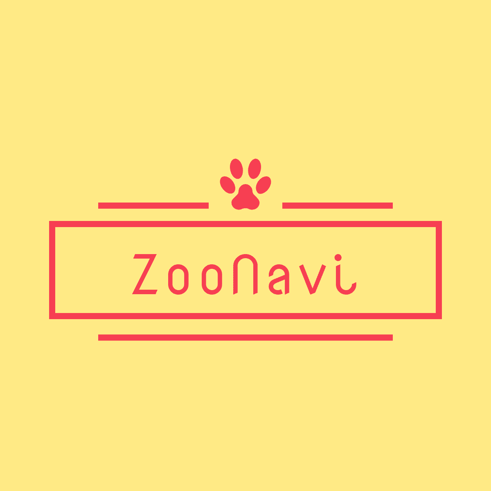

  

# ZooNavi

## サイト概要
### サイトテーマ
全国の動物園と動物の情報がまとめられたレビューサイト。

### テーマを選んだ理由
「ラッコが見たい」と思い近場の水族館に行った際、目当てのラッコは展示されておらず、後々ラッコは国内で限られた一部の水族館でしか展示されていないと知るという経験が過去にありました。 
今回のテーマ設定にあたって、動物園/水族館の公式サイトをいくつか確認してみましたが、展示されている動物の情報はほとんどなく、園内マップなどで大まかに把握することしかできない状況でした。 
そのため、どの動物園/水族館にどんな動物がいるのか詳しく知れるサービスがあれば、私と同じような水族館に行ったらラッコがいなかった……そんな悲しみを少しでも減らすことができると考え、このテーマにしました。

### ターゲットユーザ
- 国内の動物園についての情報を調べている人
- 動物についての情報を調べている人
- 目当ての動物がどの動物園で見ることができるか探している人
- 動物園についての感想を発信したい人
- 動物園の感想を調べている人

### 主な利用シーン
- 地方ごとの動物園を探す
- 目当ての動物がどの動物園で見ることができるか探す
- 向かう予定の動物園で見られる動物を調べる
- 動物園についてのレビューを投稿する
- 他の人が投稿した動物園についてのレビューを確認する

## 開発環境
- OS：Linux(CentOS)
- 言語：HTML,CSS,JavaScript,Ruby,SQL
- フレームワーク：Ruby on Rails
- JSライブラリ：jQuery
- IDE：Cloud9

## 管理者ページのログイン方法について
下記の情報を入力することで管理者としてログインできます。
- メールアドレス：admin@example.com
- パスワード　　：password